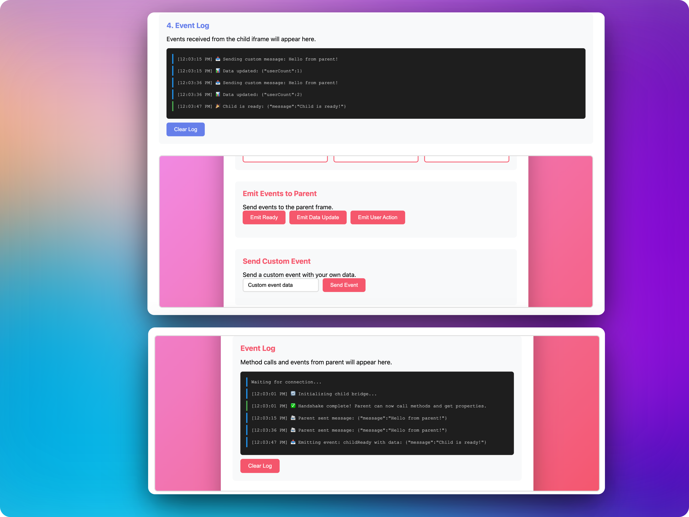
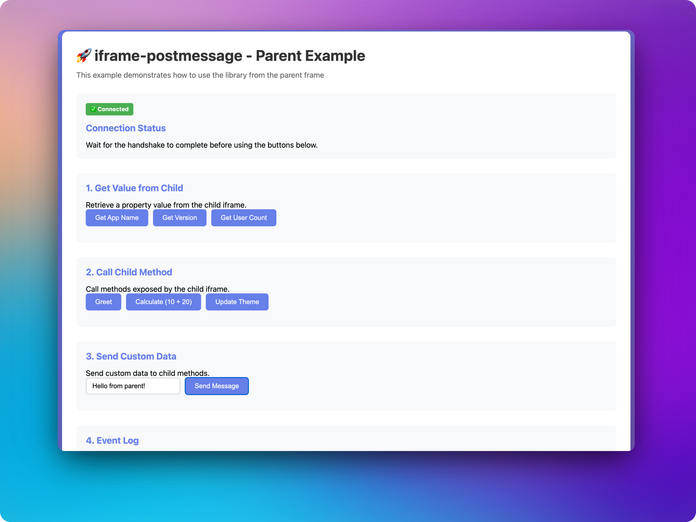
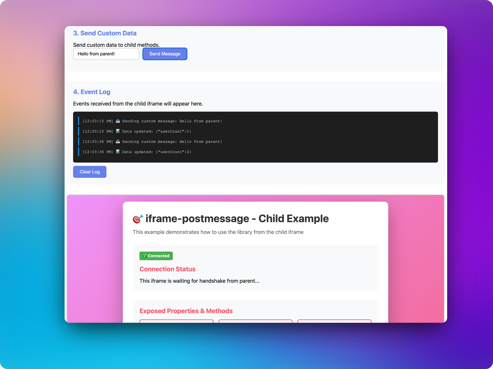
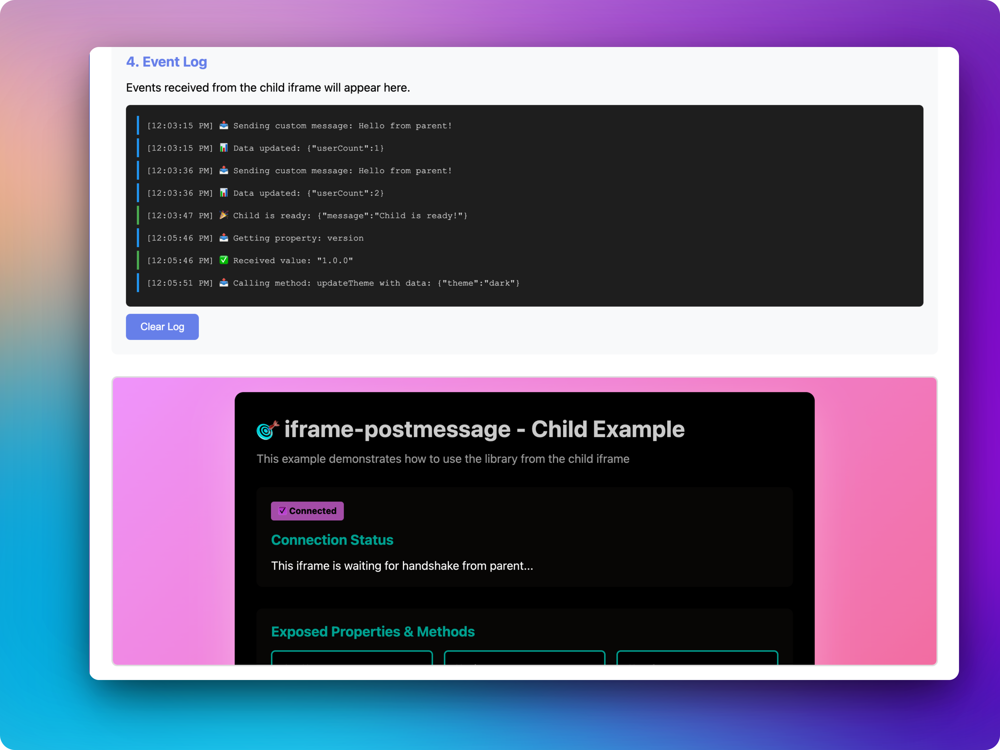

# 🚀 iframe-postmessage

> A robust, secure, and reliable cross-frame communication library for parent-child iframe messaging with enhanced multi-iframe support

[](https://www.npmjs.com/package/iframe-postmessage)
[](https://www.npmjs.com/package/iframe-postmessage)
[](https://opensource.org/licenses/MIT)
[](https://www.typescriptlang.org/)
[](https://bundlephobia.com/package/iframe-postmessage)

**iframe-postmessage** is a production-ready library that simplifies secure communication between parent pages and iframe content. Built with TypeScript, zero dependencies, and designed for concurrent multi-iframe scenarios.



## ✨ Features

- 🔒 **Secure by Default** - Origin validation and source checking prevent cross-iframe message interference
- 🎯 **Multi-iframe Support** - Instance registry tracks all active connections for concurrent iframe handling
- ⚡ **Reliable Handshake** - Enhanced handshake mechanism with fallback and timeout handling
- 📦 **Zero Dependencies** - Lightweight with no external dependencies
- 🎨 **TypeScript First** - Full TypeScript definitions included
- 🔄 **Message Queueing** - Prevents race conditions during handshake with per-instance queuing
- 🛡️ **Origin-based Routing** - Ensures messages are routed to the correct iframe
- 🚀 **Production Ready** - Battle-tested with comprehensive test coverage

## 📦 Installation

```bash
npm install iframe-postmessage
```

```bash
yarn add iframe-postmessage
```

```bash
pnpm add iframe-postmessage
```

## 🚀 Quick Start

### Parent Frame (Host Page)

```typescript
import IframePostmessage from 'iframe-postmessage';

// Create a new iframe connection
const bridge = await new IframePostmessage({
  url: 'https://example.com/child-page.html',
  container: document.getElementById('iframe-container'),
  classListArray: ['custom-iframe'],
  model: {
    // Share data/methods with child
    doSomething: (data: string) => {
      console.log('Child called doSomething with:', data);
    },
  },
});

// Get a value from child
const value = await bridge.get('someProperty');
console.log('Value from child:', value);

// Call a method on child
bridge.call('someMethod', { data: 'example' });

// Listen to events from child
bridge.on('someEvent', (data) => {
  console.log('Event from child:', data);
});

// Clean up when done
// bridge.destroy();
```

### Child Frame (Iframe Content)

```typescript
import { IframePostmessage } from 'iframe-postmessage';

// Create child model
const bridge = await new IframePostmessage.Model({
  // Expose methods/properties to parent
  someProperty: 'value',
  someMethod: (data: unknown) => {
    console.log('Parent called someMethod with:', data);
    return 'response';
  },
});

// Emit events to parent
bridge.emit('someEvent', { data: 'example' });
```

## 📚 API Reference

### `IframePostmessage` (Parent)

#### Constructor

```typescript
new IframePostmessage(config: IframePostmessageConfig): Promise<ParentAPI>
```

#### Configuration Options

```typescript
interface IframePostmessageConfig {
  url: string;                    // URL of the iframe content (required)
  container?: HTMLElement;         // Container element (default: document.body)
  classListArray?: string[];      // CSS classes to add to iframe
  title?: string;                 // iframe title attribute
  ariaLabel?: string;             // iframe aria-label attribute
  name?: string;                  // iframe name attribute
  model?: Record<string, unknown>; // Data/methods to share with child
}
```

#### Methods

| Method | Description | Returns |
|--------|-------------|---------|
| `get(property: string)` | Get a value from the child | `Promise<unknown>` |
| `call(property: string, data?: unknown)` | Call a method on the child | `void` |
| `on(eventName: string, callback)` | Listen to events from child | `void` |
| `destroy()` | Destroy the iframe connection and remove it from DOM | `void` |

### `IframePostmessage.Model` (Child)

#### Constructor

```typescript
new IframePostmessage.Model(model: Record<string, unknown>): Promise<ChildAPI>
```

#### Methods

| Method | Description | Returns |
|--------|-------------|---------|
| `emit(name: string, data: unknown)` | Emit an event to the parent | `void` |

## 💡 Usage Examples

### 🔄 Multiple Concurrent Iframes

The library handles multiple concurrent iframe connections automatically:

```typescript
const [child1, child2, child3] = await Promise.all([
  new IframePostmessage({ url: 'https://example.com/iframe1.html' }),
  new IframePostmessage({ url: 'https://example.com/iframe2.html' }),
  new IframePostmessage({ url: 'https://example.com/iframe3.html' }),
]);

// All three iframes are ready
child1.call('method1');
child2.call('method2');
child3.call('method3');
```

### ⚠️ Error Handling

```typescript
try {
  const bridge = await new IframePostmessage({
    url: 'https://example.com/child.html',
  });
  console.log('✅ Connected to child');
} catch (error) {
  console.error('❌ Failed to connect:', error);
  // Handle handshake failure
}
```

### 🎯 Async/Await Pattern

```typescript
// Modern async/await syntax
const bridge = await new IframePostmessage({
  url: 'https://example.com/child.html',
});

const value = await bridge.get('property');
bridge.call('method', { data: 'value' });
```

### 📡 Event-Driven Communication

```typescript
// Parent
bridge.on('childReady', (data) => {
  console.log('Child is ready!', data);
});

bridge.on('dataUpdate', (data) => {
  updateUI(data);
});

// Child
bridge.emit('childReady', { timestamp: Date.now() });
bridge.emit('dataUpdate', { count: 42 });
```

### 🔐 Sharing Methods and Data

```typescript
// Parent shares methods with child
const bridge = await new IframePostmessage({
  url: 'https://example.com/child.html',
  model: {
    updateParentState: (newState: any) => {
      // Update parent state
      setState(newState);
    },
    getParentConfig: () => {
      return { theme: 'dark', lang: 'en' };
    },
  },
});

// Child can call these methods
// (methods are automatically available in child's model)
```

## 📚 Live Examples

Check out the interactive examples in the `examples/` directory:



1. **Build the library**:
   ```bash
   npm run build
   ```

2. **Start a local server**:
   ```bash
   # Recommended: Use the included server (handles ES modules correctly)
   node examples/server.js

   # Or using Python 3
   python3 -m http.server 8000
   
   # Or using Node.js
   npx http-server -p 8000
   ```

3. **Open the parent example**:
   ```
   http://localhost:8000/examples/parent.html
   ```



The examples demonstrate:
- ✅ Creating iframe connections
- ✅ Getting values from child
- ✅ Calling child methods
- ✅ Listening to events
- ✅ Sharing data between parent and child



See [`examples/README.md`](./examples/README.md) for more details.

## 🛡️ Security

- ✅ **Origin Validation** - All messages are validated against expected origins
- ✅ **Source Verification** - Messages are verified to come from the correct iframe source
- ✅ **Message Type Checking** - Only valid bridge messages are processed
- ✅ **No XSS Vulnerabilities** - Safe message handling prevents injection attacks

## 🌐 Browser Support

- ✅ Chrome/Edge (latest)
- ✅ Firefox (latest)
- ✅ Safari (latest)
- ✅ Opera (latest)
- ✅ IE11+ (with polyfills)

## 📊 Performance

- **Bundle Size**: ~8KB (minified + gzipped)
- **Zero Dependencies**: No external libraries required
- **Fast Handshake**: Optimized handshake mechanism
- **Memory Efficient**: Automatic cleanup of orphaned instances

## 🧪 Testing

```bash
# Run tests
npm test

# Run tests in watch mode
npm run test:watch

# Generate coverage report
npm run test:coverage
```

## 🛠️ Development

```bash
# Install dependencies
npm install

# Build the project
npm run build

# Clean build artifacts
npm run clean
```

## 📝 TypeScript Support

Full TypeScript definitions are included. No need to install `@types/iframe-postmessage`.

```typescript
import IframePostmessage, { 
  ParentAPI, 
  ChildAPI, 
  IframePostmessageConfig 
} from 'iframe-postmessage';
```

## 🤝 Contributing

Contributions are welcome! Please feel free to submit a Pull Request.

1. Fork the repository
2. Create your feature branch (`git checkout -b feature/amazing-feature`)
3. Commit your changes (`git commit -m 'Add some amazing feature'`)
4. Push to the branch (`git push origin feature/amazing-feature`)
5. Open a Pull Request

## 📄 License

MIT © [Sangit](https://github.com/sangit0)

## 🙏 Acknowledgments

Built with ❤️ for the developer community. Special thanks to all contributors!

---
